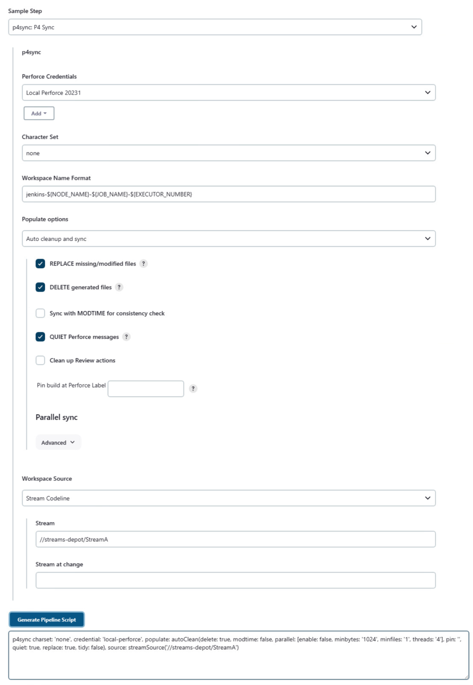

# User Setup Guide

## Credentials

The plugin makes use of the Jenkins Credential store, making it easier to manage the Helix Versioning Engine connection for multiple Jenkins jobs.  P4 Plugin credentials must be added to the 'Global' or a User defined domain, using one of the two supported plugin Credentials: 'Perforce Password Credential' or 'Perforce Ticket Credential'.


To add a Credential:

1. Navigate to the Jenkins Credentials page (select 'Credentials' on the left hand side)
2. Select 'Global credentials' (or add domain if needed)
3. Select 'Add Credentials' from the left hand side
4. Choose 'Perforce Password Credential' from the 'Kind' drop-down select
5. Enter a Description e.g. local test server
6. Enter the P4Port e.g. localhost:1666
7. Enter a valid username and password
8. Press the 'Test Connection' button (you should see Success)
9. Click 'Save' to save.
 


The 'Perforce Ticket Credential' supports using a ticket file (such as the default P4TICKETS file) or a ticket value (returned by the command p4 login -p).  If Ticket authentication is used for remote builds the Ticket must be valid for the remote host (either login on the remote host or use p4 login -a). 

All P4 plugin Credential types support SSL for use on a Secured Helix Versioning Engine (P4D); to use just check the SSL box and provide the Trust fingerprint.


## Workspaces

Perforce Helix Workspaces are configured on the Jenkin Job configuration page and support the following behaviours:

* Static

The Workspace specified must have been previously defined.  The plugin user must either own the workspace or the spec should be unlocked allowing it to make edits.  The Workspace View remains static, but Jenkins will update other fields such as the Workspace root and clobber option.


* Spec File

The Workspace configuration is loaded from a depot file containing a Client Workspace Spec (same output as p4 client -o and the Spec depot '.p4s' format). The name of the Workspace must match the name of the Client Workspace Spec.


* Manual

Allows the specified Workspace to be created (if it does not exist) or update the spec by setting the various options.  Jenkins will fill out the Workspace root and may override the clobber option.


* Template & Stream

In this mode the Workspace View is generated using the specified template workspace or stream.  The name of the Workspace is generated using the Workspace Name Format field and makes it an ideal choice for Matrix builds.


## Variable expansion

Many of the Workspace fields can include environment variables to help define their value.  Take the 'Worksapce name' often I use:

    jenkins-${NODE_NAME}-${JOB_NAME}
    
If the job is called 'foo' and built on a slave 'linux' it expands to:

    jenkins-linux-foo
       
Jenkins provides a set of environment variable and you can also define your own. Here is a list of built in variables:

`BUILD_NUMBER` - The current build number, such as "153"  
`BUILD_ID` - The current build id, such as "2005-08-22_23-59-59"  
`BUILD_DISPLAY_NAME` - The name of the current build, something like "#153".  
`JOB_NAME` - Name of the project of this build, such as "foo"  
`BUILD_TAG` - String of "jenkins-${JOB_NAME}-${BUILD_NUMBER}".  
`EXECUTOR_NUMBER` - The unique number that identifies the current executor.  
`NODE_NAME` - Name of the slave or "master".  
`NODE_LABELS` - Whitespace-separated list of labels that the node is assigned.  
`WORKSPACE` - Absolute path of the build as a workspace.  
`JENKINS_HOME` - Absolute path on the master node for Jenkins to store data.  
`JENKINS_URL` - URL of Jenkins, like http://server:port/jenkins/  
`BUILD_URL` - Full URL of this build, like http://server:port/jenkins/job/foo/15/  
`JOB_URL` - Full URL of this job, like http://server:port/jenkins/job/foo/  

The plugin allows the use of environemnt vaiables in fields like the Workspace view and Stream path.  For example:

    //depot/main/proj/... //jenkins-${NODE_NAME}-${JOB_NAME}/...
    
or with a Matrix build you might have defined your own variables like `${OS}`.  Remember they can be used anywhere in the mapping:

    //depot/main/${JOB_NAME}/bin.${OS}/... //jenkins-${NODE_NAME}-${JOB_NAME}-${OS}/bin/${OS}/... 


## Populating

The plugin will populate the Jenkins workspace with the file revisions needed for the build. The way the workspace is populated is configured on the Jenkins Job configuration page and support the following behaviours:

* Automatic cleanup and sync

The plugin will revert any shelved or pending files from the workspace; this includes the removal of files that were added by the shelved or pending change. Depending on the two check options boxes the plugin will then clean up any extra files or restore any modified or missing files. Finally, the plugin will sync the required file revisions to the workspace populating the 'have' table.


* Forced clean and sync

The plugin will remove all files from under the workspace root, then force sync the required file revisions to the workspace.  If the populating the 'have' table options is enabled then the 'have' list will be updated.


This method is not recommended as the cost of IO resources on server and client are high.  Apart from exceptional circumstances the Automatic cleanup and sync option will produce the same result.

* Sync only

The plugin will not attempt to cleanup the workspace; the sync operation will update all files (as CLOBBER is set) to the required set of revisions.  If the populating the 'have' table options is enabled then the 'have' list will be updated.


## Building

To build immediately select the Build now button...


Or use the call the build/ URL endpoint e.g. http://jenkins_host:8080/job/myJobID/build

(where myJobID is the name of your job and jenkins_host the name or IP address of your Jenkins server).

### Building at a change

A Jenkins job can build at any point in the codes history, identified by a Perforce Helix change or label.

The Jenkins job can be _pinned_ to a Perforce Helix change or label by setting the `Pin build at Perforce Label` field under the Populate options.  Any time the Jenkins job is trigged, it will only build upto the pinned point.

Alternativly, a change or label can be passed using the `Build Review` paramiters or URL end point (see the _Build Review_ chapter for details) 

Related issues: [JENKINS-29296](https://issues.jenkins-ci.org/browse/JENKINS-29296)

### Parallel builds

The plugin supports parallel execution of Jenkins Jobs.  Jenkins will create a new workspace directory `workspace@2` and so on.  The plugin will automatically template the current workspace appending `.clone2` for the templates' name.

### Custom parellel builds

For custom workspaces, where an alternative location has been set e.g. _Advanced_ --> _Use custom workspace_ --> _Provide a Directory_.  Then you will need to add the executor number to the end of your path.  

For example:

    /Users/pallen/Workspaces/custom@${EXECUTOR_NUMBER}
    
The plugin will then correctly template the workspaces as needed.

## Triggering

Perforce can trigger Jenkins to Build based on an event, such as a submitted change.  A triggered build requires an administrator to add a Perforce trigger (Perforce documents [here](https://www.perforce.com/perforce/doc.current/manuals/p4sag/chapter.scripting.html)).  

The trigger will need to POST a JSON payload to the Jenkins end-point `p4/change/`.  The JSON payload must contain the `p4port` string that matchs the P4Port field specified in the Perforce Credential.

For example, a simple `change-commit` trigger might use curl:

    #!/bin/bash
    CHANGE=$1
    curl --header 'Content-Type: application/json' \
         --request POST \
         --data payload="{change:$CHANGE,p4port:\"localhost:1666\"}" \
         http://localhost:8080/jenkins/p4/change

and have an entry in `p4 triggers` for changes on `//depot/...`:

	jenkins   change-commit   //depot/...   "/p4/common/bin/triggers/jenkins.sh %change%"

On the Jenkins side you need to enable the 'Perforce triggered build' in the Job Configuration:


### Manual triggers

Jobs can be manually triggered by using the 'P4 Trigger' button on the top level Jenkins page:


and compleating the trigger form:


## Polling

Building a Jenkins Job can be triggered using the SCM polling option, Build Now button or calling the build/ URL endpoint.

To enable SCM polling, check the 'Poll SCM' option and provide a Schedule using the Cron format.  For example every 10 minutes Monday to Friday, the 'H' is a time offset (calculated using a Hash of the Job name).


## Filtering

When polling is used, changes can be filtered to not trigger a build; the filters are configured on the Jenkin Job configuration page and support the following types:

### Limit polling to Master

The Polling event is calculated from the Master node (even if the build would normally occur on the Slave).  When enable, polling does not require a Perforce Workspace and the last built change is determined from the previous Jenkins build log.  


### Polling per change

The polling event will only return the oldest unbuilt change, resulting in incremental builds.


### Exclude changes from user

Changes owned by the Perforce Helix user specified in the filter will be excluded.


### Exclude changes from Depot path

Changes where all the file revision's path starting with the String specified in the filter will be excluded.


For example, with a Filter of "//depot/main/tests":

Case A (change will be filtered):

    Files:
        //depot/main/tests/index.xml
        //depot/main/tests/001/test.xml
        //depot/main/tests/002/test.xml

Case B (change will not be filtered, as build.xml is outside of the filter):

    Files:
        //depot/main/src/build.xml
        //depot/main/tests/004/test.xml
        //depot/main/tests/005/test.xml
 
## Review

The plugin supports a Build Review Action with a `review/build/` URL endpoint.  Parameters can be passed informing Jenkins of Perforce Helix shelf to unshelve and changelist to sync to.  There are also Pass/Fail callback URLs for use with Swarm.

An example URL that would build the review in the shelved change 23980:

`http://jenkins_host:8080/job/myJobID/review/build?status=shelved&review=23980`

The Build Review Action support the following parameters:
* status (shelved or submitted)
* review (the pending shelved change)
* change (the submitted change)
* label (a Perforce label, instead of change)
* pass (URL to call after a build succeeded)
* fail (URL to call after a build failed)

*Please note these paramiter are stored in the Environment and can be used with variable expansion e.g. `${label}`; for this reason please avoid these names for slaves and matrix axis.*

The Build Review Action can be invoked manually from within Jenkins by selecting the Build Review button on the left hand side.  This provides a form to specify the parameters for build.


## Unshelve Build step

The plugin supports unshelving one or more shelved changes into your Jenkins workspace as a build step. Select the 'Perforce: Unshelve' from the 'Add build step' dropdown and provide a change-list number or custom environment variable `${VAR}` in the 'Unshelve Changelist` box.


There is an optional 'Resolve Option' select box to choose the type of resolve to use on the unshelved files. This might be needed if the shelved revisions are at a different revision to the files sync'ed in the workspace.

## Changes Summary

After a build Jenkins provides the ability to see the details of a build.  Select the build of interest from the Build History on the left hand side.  You then get a Perforce change summary for the build and clicking on the View Detail link for specific files.


Detailed view...


## Tagging Builds

Jenkins can tag builds automatically as a Post Build Action or allow manual tagging of a build.  The Tags are stored in Perforce Helix as Automatic Labels with the label view based on the workspace at the time of tagging.

Tagging with Post Build Action


Manual Tagging

* Select the build that you wish to tag from the project page.


* Click on the 'Label This Build' link on the left hand panel, if the build has already been tagged the link will read 'Perforce Label'.


* Update the label name and description as required and click 'Label Build' to add the label to Perforce Helix.


* Once the build is labeled you will see the label details appear in a table above.  New labels can be added to the same build or labels can be updated by providing the same label name.

## Publishing Build assets

Jenkins can automatically shelve or submit build assets to Perforce.  Select the 'Add post-build action' and select the 'Perforce: Publish assets' from the list.  Select the Credentials and Workspace options, you can connect to a different Perforce server if required.  Update the description if required, `${variables}` are expanded.

Shelving with Post Build Action


Submitting with Post Build Action


## Repository Browsing

Repository browsing allows Jenkins to use an external browser, like Swarm, P4Web, etc... to navigate files and changes associated with a Jenkins build.

To enable the feature select the Repository browser from the Job Configuration page and provide the full URL to the browser.


Link to change in Swarm


## Workflow support

The plugin supports the [Workflow](https://wiki.jenkins-ci.org/display/JENKINS/Workflow+Plugin) and has DSL support for Perforce Helix `p4sync`, `p4unshelve`, `p4tag` and `p4publish`.

To use the Workflow install the plugin(s) as needed.  Create a new Workflow Job by selecting 'New Item' from the left hand menu, provide an 'Item name' and choose a 'Workflow' project.

The Workflow plugin requires a Groovy script.  Currently the `Groovy CPS DSL from SCM` is *not* supported.  Select `Groovy CPS DSL` and provide your script in the text box below.

You can use the snippet genertor to create each step and use the code to compose your workflow script.  

For example, a basic sync script:

1. Check the 'Snippet Generator' box and from the 'Sample Step' drop down choose `P4 Sync`.
2. Select a valid P4 plugin Credential
3. Fill out *ONLY ONE* of the three boxes for the code source.

e.g.

        Stream Codeline    : //streams/st1-main

or

        Template Workspace : template_ws
        
or

        Depot path         : //depot/projX

    
        
Press the 'Generate Groovy' button...



Use this snippet with your intended target e.g. a slave calles 'my_slave'

    node('my_slave') {
       p4sync credential: 'server_id', stream: '//stream/main'
    }

For more examples and usage please refer to the [Workflow docs](https://github.com/jenkinsci/workflow-plugin/blob/master/README.md).

### Workflow Limitations

There are several limitations as the Workflow plugin is relativly new, these include:

* SCM Polling (not functional)
* No access to Environment ${VAR} varables

## Troubleshooting

### Connection issues


**Error**: Setting up a SSL Credentials connection to a Helix Versioning Engine (P4D).

```
Unable to connect: com.perforce.p4java.exception.ConnectionException:
Error occurred during the SSL handshake:
invalid SSL session
```

**Solution**: Due to current US export control restrictions for some countries, the standard JDK package only comes with 128 bit encryption level cyphers. In order to use P4Java to connect to an SSL-enabled Helix Versioning Engine (P4D), those living in eligible countries may download the unlimited strength JCE (Java Cryptography Extension) package and replace the current default cryptography jar files on the build server with the unlimited strength files. 

The libraries can be downloaded from:

   http://www.oracle.com/technetwork/java/javase/downloads/jce-7-download-432124.html

Installation instructions can be found in the file 'README.txt' in the JCE download.

---

**Error**: Perforce login error part way through a build with an Edge/Commit setup.

```
Perforce password (P4PASSWD) invalid or unset.
- no such file(s).
ERROR: Unable to update workspace:
com.perforce.p4java.exception.AccessException: Perforce password (P4PASSWD) invalid or unset.
```

**Solution**: The following configurables must be set to allow the Edge to forward the login information to the Commit server.  

`p4 configure set cluster.id=myID`
`p4 configure set myEdge#rpl.forward.login=1`

## Known limitations
* One Jenkins Job per Swarm branch
