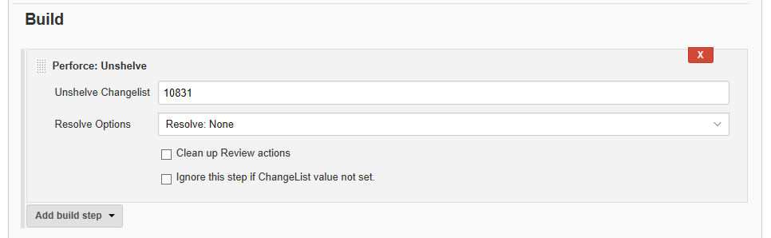

# Peforce: Unshelve
The P4-plugin supports unshelving of one or more shelved changes into your Jenkins workspace as a build step.  
Click the **Add build step** button and select **Perforce: Unshelve** from the dropdown list. 
**Note:** The unshelve event is not recorded in the Jenkins build history. 

- **Unshelve Changelist:** Select the changelist you want to unshelve for the build by entering the change-list number or a custom environment variable `${VAR}`. For more information about environment variables, see [Variable Expansion](VARIABLEEXPANSION.md).  
- **Resolve Options:** Select the type of resolve to use for the unshelved files. This is needed if the shelved file revisions are different to the files sync'ed in the workspace.  
   - **Resolve: None:** The current workspace files are used for the build.   
   - **Resolve: Safe (-as):** Accepts the file in the depot if it has the only changes. Accepts the file in the workspace if it has the only changes. Doesn’t resolve if both the depot and workspace files have changed.   
   - **Resolve: Merge (-am):** Accepts the file in the depot if it has the only changes. Accepts the workspace file if it has the only changes. Merges changes if both the depot and workspace files have changed and there are no conflicts.   
   - **Resolve: Force Merge (-af):** Accepts the file in the depot if it has the only changes. Accepts the workspace file if it has the only changes. Creates a merged file if both the depot and workspace files have changed, even if there are conflicts. Where there are conflicts, both versions are included with text notations indicating the conflicts.   
   - **Resolve: Yours (-ay): -- keep your edits:** Uses the file that is in the workspace and ignores the version of the file that is in the depot.   
   - **Resolve: Theirs (-at) -- keep shelf content:** Replaces the copy of the file in the workspace with the revision that is in the depot, discards any changes in the workspace file.   
- **Clean up Review actions:**  Reverts open files in the pending changelist, but leaves the content in the workspace unchanged. Equivalent to `p4 revert -k`.  If this option is not selected an error is displayed.  
- **Ignore this step if Changelist value not set:** Select to ignore the **Perforce: Unshelve** build step if **Unshelve Changelist** has no value. This is useful if you are using a variable that can leave the value unset for some builds. 

Click the browser **Back** button to go back to the previous page.  
