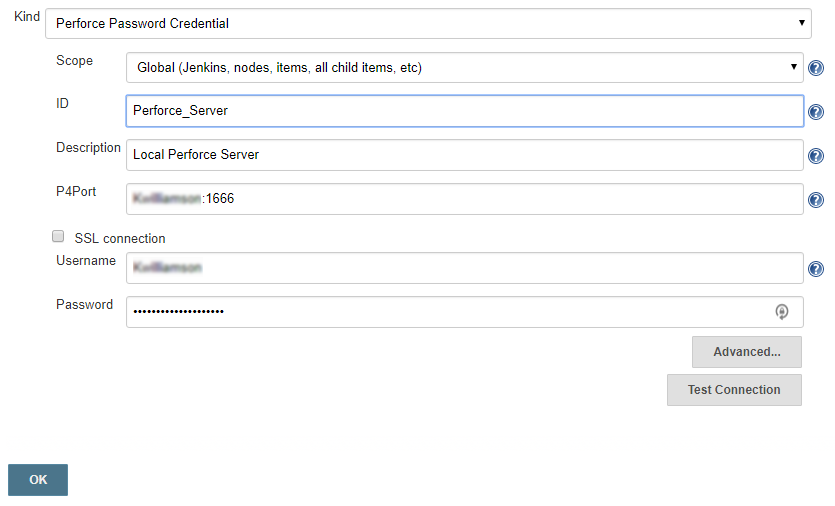
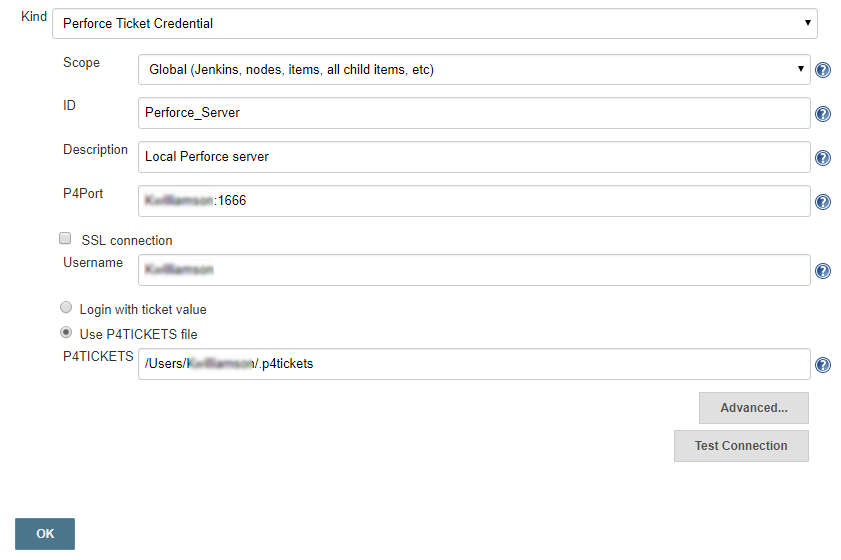

# Credentials
The plugin makes use of the Jenkins Credential store, making it easier to manage the Helix Core Server (P4d) connection for multiple Jenkins jobs. P4 Plugin credentials must be added to a **Global** or **User defined domain**, using one of the two supported plugin Credentials: **Perforce Password Credential** or **Perforce Ticket Credential**.

## Add a credential
1. Navigate to the Jenkins Credentials page by clicking **Credentials** in the sidebar menu. 
 2. Add a domain if required. 
 3. Click the **(global)** link in the **Stores scoped by Jenkins** table. 
 4. Click **Add credentials** in the sidebar menu. 
 5. Now complete credential configuration by selecting one of the following credential types:
- [Add a Perforce Password Credential](#add-a-perforce-password-credential)
- [Add a Perforce Ticket Credential](#add-a-perforce-ticket-credential). 

### Add a Perforce Password Credential
 
 1. Select **Perforce Password Credential** from the **Kind** dropdown. 
 2. Select the scope for the credential from the **Scope** dropdown. 
 3. If you are using Freestyle to configure jobs, the **ID** field can be left blank. If you are using Pipeline or MultiBranch to configure jobs, enter a unique ID for the credentials in the **ID** field. 
 4. **Optional:** Enter a description for the credential in the **Description** field. 
 5. Enter the server and port number details in the **P4Port** field. 
 For example:
 10.0.0.4:1666
 perforce:1666
 perforce.domain.com:1666
 localhost:1666
 6. If the Perforce Helix Server is configured for SSL connections, select the **SSL connection** checkbox and enter the Trust fingerprint in the **Trust** field. If you have a problem connecting with SSL, see [Error using SSL](#error-using-ssl)  below. 
 7. Enter a valid username in the **Username** field. The minimum protection level for the jenkins user account is open. 
 8. Enter a valid password in the **Password** field.
 9. To check that you have configured the credentials correctly, click **Test Connection**.  The credentials are tested against the Perforce Helix Server and if they are configured correctly **Success** is displayed. 
 10. Click **Save** to save the credentials.  
 11. Click the browser **Back** button to go back to the previous page. 
 
### Add a Perforce Ticket Credential
The **Perforce Ticket Credential** supports using a ticket file such as the default P4TICKETS file or a ticket value returned by the command `p4 login -p`. 
 
 1. Select **Perforce Ticket Credential** from the **Kind** dropdown. 
 2. Select the scope for the credential from the **Scope** dropdown. 
 3. If you are using Freestyle to configure jobs the **ID** field can be left blank. If you are using Pipeline or MultiBranch to configure jobs enter a unique ID for the credentials in the **ID** field. 
 4. **Optional:** Enter a description for the credential in the **Description** field. 
 5. Enter the server and port number details in the **P4Port** field. 
 For example:
 10.0.0.4:1666
 perforce:1666
 perforce.domain.com:1666
 localhost:1666
 6. If the Perforce Helix Server is configured for SSL connections, select the **SSL connection** checkbox and enter the Trust fingerprint in the **Trust** field. If you have a problem connecting with SSL, see [Error using SSL](#error-using-ssl)  below. 
 7. Enter a valid username in the **Username** field. The minimum protection level for the jenkins user account is open. 
 8. Select one of the following options for the Perforce ticket: 
 **Ticket value:** Select the **Login with ticket value** checkbox and enter a valid session ticket. Use the `p4 login -p` command to print the ticket, add the '-a' flag to enable the ticket to be used from any machine. 
 **P4TICKETS file:** Select the **Use P4TICKETS file** checkbox and enter the full path to the Perforce tickets file. Typically */[HOME]/.p4tickets* or *c:\[HOME]\p4tickets.txt*. 
9. To check that you have configured the credentials correctly, click **Test Connection**.  The credentials are tested against the Perforce Helix Server and if they are configured correctly **Success** is displayed. 
 10. Click **Save** to save the credentials.
 11. Click the browser **Back** button to go back to the previous page. 

## Connection Issues
### Error using SSL
**Error**: Setting up a SSL Credentials connection to a Helix Server (P4D).
```
Unable to connect: com.perforce.p4java.exception.ConnectionException:
Error occurred during the SSL handshake:
invalid SSL session
```
**Solution**: Due to current US export control restrictions for some countries, the standard JDK package only comes with 128 bit encryption level cyphers. In order to use P4Java to connect to an SSL-enabled Helix Server (P4D), those living in eligible countries may download the unlimited strength JCE (Java Cryptography Extension) package and replace the current default cryptography jar files on the build server with the unlimited strength files.
The libraries can be downloaded from:
[http://www.oracle.com/technetwork/java/javase/downloads/jce-7-download-432124.html](http://www.oracle.com/technetwork/java/javase/downloads/jce-7-download-432124.html)
Installation instructions can be found in the file 'README.txt' in the JCE download.

Click the browser **Back** button to go back to the previous page.

### Error with Edge/Commit Server

**Error**: Perforce login error part way through a build with an Edge/Commit setup.
```
Perforce password (P4PASSWD) invalid or unset.
- no such file(s).
ERROR: Unable to update workspace:
com.perforce.p4java.exception.AccessException: Perforce password (P4PASSWD) invalid or unset.
```
**Solution**: The following configurables must be set to allow the Edge to forward the login information to the Commit server.

`p4 configure set cluster.id=myID`  `p4 configure set myEdge#rpl.forward.login=1`

Click the browser **Back** button to go back to the previous page. 
