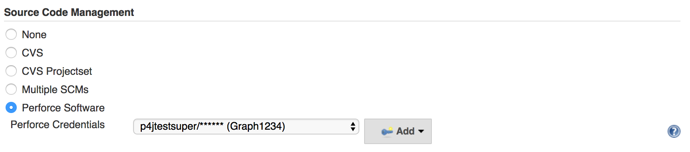
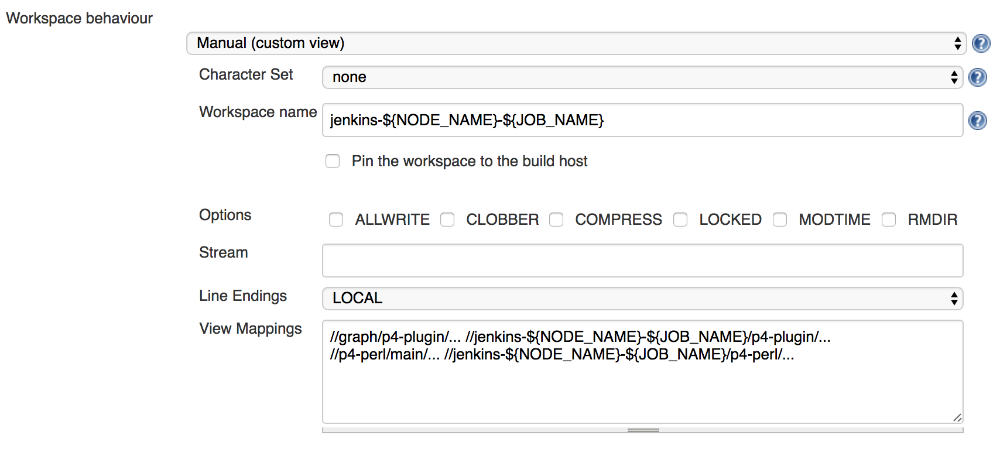
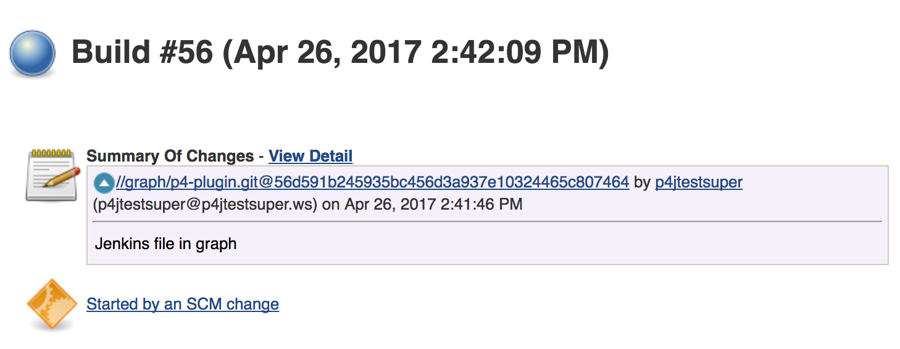
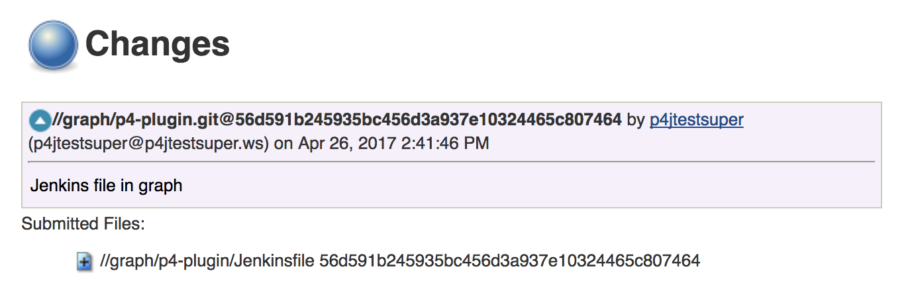
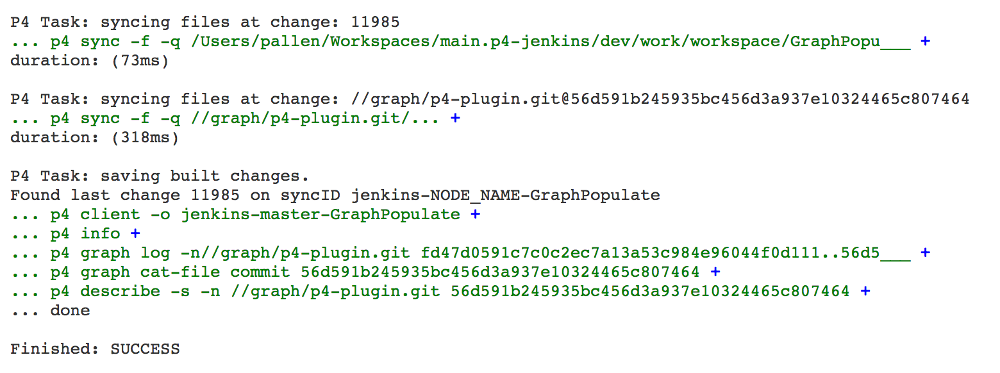
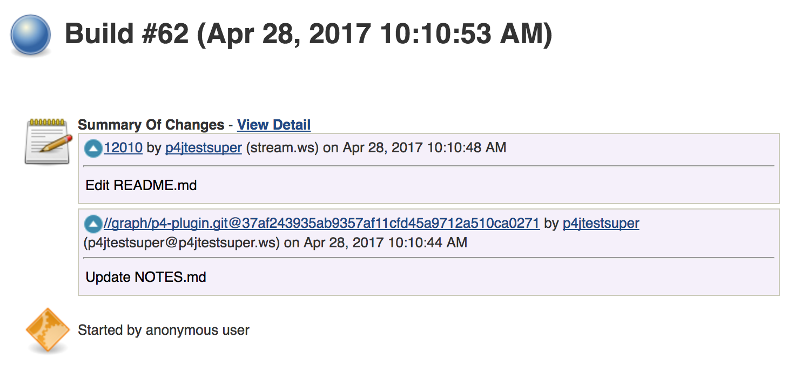
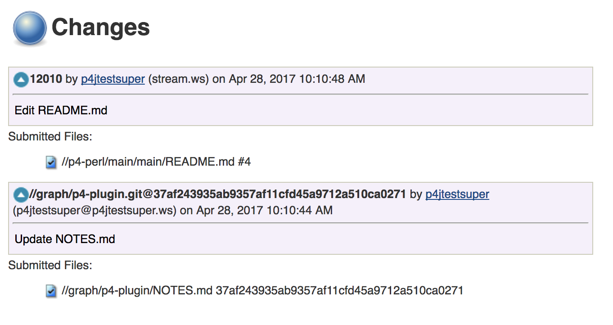
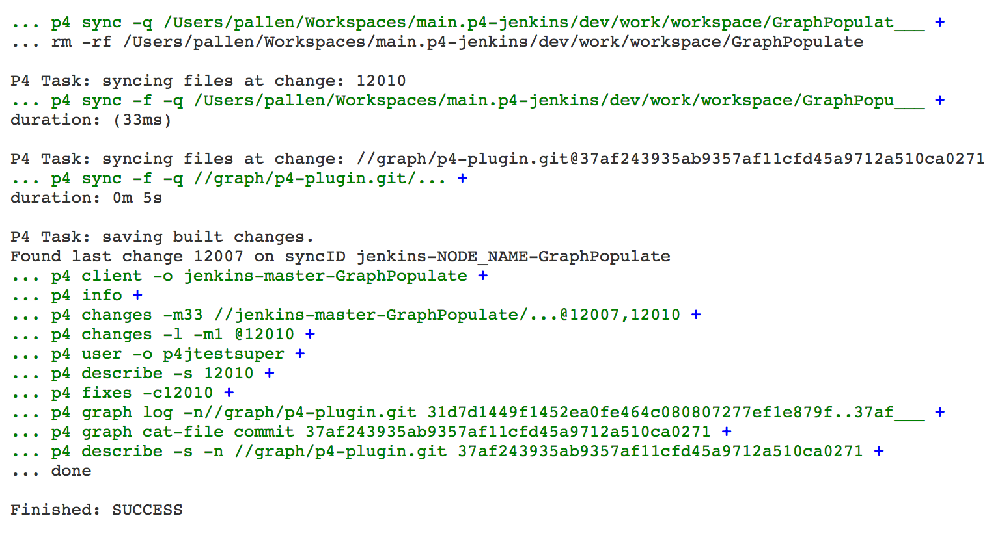

# Perforce Graph Setup Guide

This guide covers the setup and configuration of a Perforce Graph or Hybrid environment in Jenkins.  It assumes an
understanding of Perforce workspace Views, Graph repository setup and permission management. 

## Additional Requirements

* Helix Versioning Engine 2017.1 or greater.
* Minimum Graph Permission of `read` on Graph Repos for the Jenkins user.

## Graph Populate

Graph can populate files using a Jenkins Freestyle or Pipeline job, although some options are restricted.  MultiBranch
is also supported, but only for individual repositories and not for a mix of Classic or Stream paths.  The following
setup guide uses a Jenkins Freestyle Job for the example.  

Populating a Workspace with a Graph repository requires a regular Perforce Password or Perforce Ticket credential, 
however the Perforce server must be 2017.1 or greater.

Graph can use any Workspace mode; this example uses the Manual Workspace option to easily show the Workspace View. 
The example below maps a Graph repository `//graph/p4-plugin` and a Streams path `//p4-perl/main` into the
workspace.

For Jenkins to populate a workspace containing one or more Graph repositories the `Graph force clean and sync` option
must be used.  Currently reconcile options are not fully supported by Graph, and only the force clean option with the 
population of the have list is supported.

Once your Jenkins Freestyle or Pipeline Job is configured with a Graph repository, you can build, poll or trigger 
builds as normal.  The build summary will show the Graph repository and associated SHA instead of a Perforce
changelist number.

You can view the Graph commit details and see the files in the commit.  Linking a Repository Browser is supported, 
however Swarm currently does not view Graph repository files or their history.

When using a Graph repository you will see an additional 'classic' sync before the graph repository syncs, this 
allows hybrid paths to be pinned at a label or change in addition to the graph repositories being synced.

You will see extra `p4 graph` commands in the log for reporting the commit details and recording the commits 
included in the build.

If you have a Hybrid view containing a classic or streams path along with a Graph repository, the Jenkins build will
report both changes (assuming that both paths had changes), this is also true for polling events.  Below is an example
of a build with a change to a stream and graph repository:

An example showing the detailed view of changed files in the Stream Changelist and Graph Commit:

... and associated log output:

