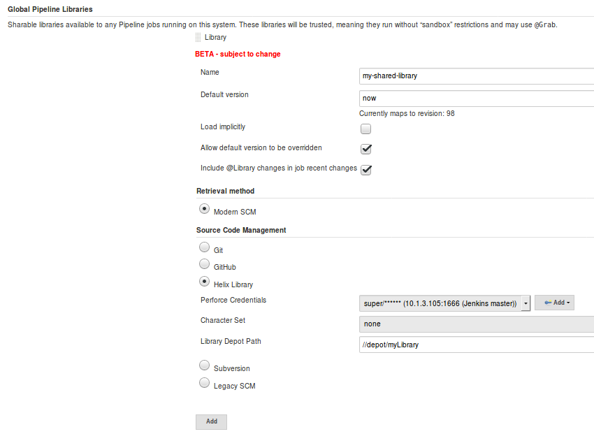

_Online documentation for [Pipeline Library](https://www.perforce.com/manuals/jenkins/Content/P4Jenkins/library.html#Global_Pipeline_Library_guide)_

# Global Pipeline Library Guide

A guide on how to access Pipeline libraries versioned in Perforce Helix. 

## Global Setup

Open the Jenkins Configuration (`Manage Jenkins`> `Configure System`) and scroll down to `Global Pipeline Libraries`:

## Sample library structure

Depot path: `//depot/myLibrary/src/org/foo/lib.groovy`

Library content:

    package org.foo;
 
    def testFunc ()
    {
      echo "HELLO FROM testFunc"
    }
    return this;

## Importing a library in a Pipeline script

An example Pipeline Script:

    @Library('my-shared-library')
    import org.foo.lib.*
 
    pipeline {
    
      agent { label 'master' }
      
      stages {
        stage("Run script") {
          steps {
            script {
               def z = new org.foo.lib()
               z.testFunc()
            }
          }
        }
      }
    }

