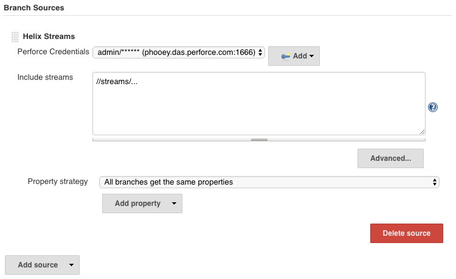

# MultiBranch Pipeline Guide

MulitBranch Pipeline support allows Jenkins to automatically find branches or change reviews in Perforce and create 
Jenkins Pipeline Jobs to build them.

Perforce has many ways to represent a Project or collection of related branches; in order to best support the 
different uses the p4-plugin uses four implementations of `SCMSource`:

 - Helix Branches
 - Helix Streams
 - Helix Swarm
 - Helix4Git
 
To create a MulitBranch Pipeline choose _New Item_ from the main menu, provide a name and select _Multibranch Pipeline_
from the list.


In the configuration you will need to add one of the Helix `SCMSource` implementations; under the _Branch Source_ group
select the appropriate implementation from the drop-down _Add source_ menu.

Each `SCMSource` implementation will require a Credential, a set of Perforce paths specific to the implantation, an
optional filter and Advance options (Populate and Repository Browsing behaviour).  

## Source Configurations

Example configuration for each of the MultiBranch `SCMSource` Implementations supported by the p4-plugin.

### Helix Streams

A simple example configuration for Helix Streams:



Jenkins will now probe each child stream associated with the _Include streams_ path `//streams/...` 
(effectively all the streams returned by the command `p4 streams //streams/...`), if the probe finds a `Jenkinsfile` 
in the stream then it creates a Pipeline Job and schedules a build.

You can provide a list of stream depots in the _Include streams_ (separated by a new line) to include other streams in
the search.

### Helix Swarm

The MultiBranch configuration for Swarm requires the Credential and the Swarm project name `multiswarmtest` for this
example:


The p4-plugin will use the Swarm API to query what branches are used in the Swarm Project and then probe for the 
`Jenkinsfile` to create the Pipeline build.  

In addition to finding the branches in a Swarm project the p4-plugin will query Swarm for pre and post commit reviews.
The p4-plugin will create Pipeline Job for each open review and gather the pipelines in a _Reviews_ tab separate to
the default _Branches_ tab.


### Helix4Git

The Helix4Git configures one or more Git repositories backed by a Helix Graph depot.  Provide the Credentials and a
list of one or more Graph (Git) Repository.  

For example; include a graph depot called `//plugins` with a Git Repository called `p4-plugin`. Note that the advanced
option has been expanded to show that Graph based syncs have a limited set of Populate options, where 
_Graph force clean and sync_ is the recommended default:


The p4-plugin will than scan all Git Branches and open Pull Requests,
building Pipeline Jobs as required.  Due to the multi-multi relationship with repositories and branches the Job naming 
convention is `{depot}.{repo}.{branch}` for branches and `{depot}.{repo}.{branch}.{ref}` for pull requests.


### Helix Branches

Helix branches is more complex to define as there is no 'project' definition to group the set of Perforce depot paths
together.  

In addition to the Credentials Users will need to specify the parent path for the branches in the
_Include branches_ text box. The _Include filter_ can be used to filter the list of candidate branches found by the
initial search.

For example, a depot my contain the following branches, but you only want to build the `com*` branches:

```
//depot/projA/comX
//depot/projA/comX
//depot/projA/comX
//depot/projA/resA
//depot/projA/resB
```


If the `Jenkinsfile` is found in each branch you will get the following Multi Pipeline branches:
 


## Build Configuration options

Extra options and customisations.

### Jenkinsfile Script Path

If your `Jenksinfile` is located in a subdirectory or uses a different name, Jenkins provide a Build Configuration
option to allow customisation.


### Lightweight checkout vs default checkout

Lightweight checkout is automatically applied by Jenkins to MultiBranch jobs; you may wish to disable the default checkout of your code
and add your own checkout step in the Jenkinsfile.  Simply add `options { skipDefaultCheckout() }` to the agent.  

For example:

```groovy
pipeline {
    agent any
    
    options { skipDefaultCheckout() }
    
    stages {
        stage('Checkout') {
            steps {
                p4sync credential: 'id', populate: forceClean(), source: streamSource('//stream/main')
            }
        }
        stage('Build') {
            steps {
                echo 'Building...'
            }
        }
        stage('Test') {
            steps {
                echo 'Testing...'
            }
        }
        stage('Deploy') {
            steps {
                echo 'Deploying...'
            }
        }
    }
}
```

## MultiBranch trigger SCM Events

Perforce can trigger Jenkins to build MultiBranch projects based on an event, such as a submitted change. 
 
A triggered build also requires an administrator to add a Perforce trigger to the Perforce server. For information about adding a trigger, see [Using triggers to customize behavior](https://www.perforce.com/perforce/doc.current/manuals/p4sag/chapter.scripting.html) in [Helix Core Server Administrator Guide: Fundamentals](https://www.perforce.com/perforce/doc.current/manuals/p4sag/index.html#P4SAG/about.html).
The trigger needs to POST a JSON payload to the Jenkins end-point  `JENKINS_URL/p4/event/`. 

### Perforce Change JSON payload

```
{
  "p4port":      P4PORT,          Perforce P4PORT (must match the Jenkins Credential)
  "change":      10001,           Change number to sync files for build
  "event_type":  "UPDATED"        Event type (currently only UPDATED is supported)
}
```

### Swarm Commit JSON payload

```
{
  "p4port":      P4PORT,          Perforce P4PORT (must match the Jenkins Credential)
  "project":     PROJECT,         Swarm Project name
  "branch":      BRANCH,          Swarm Branch name
  "path":        PATH,            Swarm Path name
  "change":      10001,           Change number to sync files for build
  "status":      "committed",     Change status is "committed"
  "event_type":  "UPDATED"        Event type (currently only UPDATED is supported)
}
```

### Swarm Shelved JSON payload (draft: not yet supported)

```
{
  "p4port":      P4PORT,          Perforce P4PORT (must match the Jenkins Credential)
  "project":     PROJECT,         Swarm Project name
  "branch":      BRANCH,          Swarm Branch name
  "path":        PATH,            Swarm Path name
  "change":      10001,           Change number to sync files for build
  "review":      10022,           Review number to unshelve for build
  "status":      "shelved",       Change status is "shelved"
  "event_type":  "UPDATED"        Event type (currently only UPDATED is supported)
}
```
