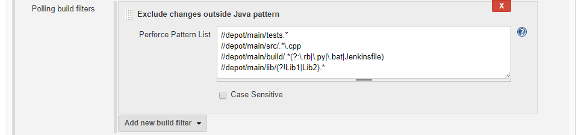

# Exclude Changes From Outside Java Pattern
Changes can be filtered to not trigger a build if none of the files within a change match the Java patterns (regular expression) listed.

**For example, with the following regular expressions:**  
`//depot/main/tests.*`  
`//depot/main/src/.*\.cpp`  
`//depot/main/build/.*(?:\.rb|\.py|\.bat|Jenkinsfile)`  
`//depot/main/lib/(?!Lib1|Lib2).*`  
 - The change below is not filtered because these files match the pattern on `tests.*`:
`//depot/main/tests/CONTRIUBTING.md`
`//depot/main/tests/001/index.xml`
 - This change below is NOT filtered because the file matches the pattern on `tests.*` which was probably intended to describe a  `tests/` directory. This is an example as to why you should be careful when using incomplete file paths.
`//depot/main/tests.doc`
- The change below is NOT filtered because all of the files match the pattern looking for script files in `build/`:
`//depot/main/build/rbs/deploy_server.rb`
`//depot/main/build/deploy/deploy.bat`
`//depot/main/build/Jenkinsfile`
- The change below is filtered because none of the files match the pattern looking for `.cpp` files under `main/src`:
`//depot/main/src/howto.doc`
`//depot/main/src/oldmain.c`
`//depot/main/src/art/splash.bmp`
`//depot/main/src/bt/funnelcake.php`
- The change below is filtered because `Lib1` is included in a negative lookahead, and is excluded:
`//depot/main/lib/Lib1/build.xml`

Click the browser **Back** button to go back to the previous page. 
