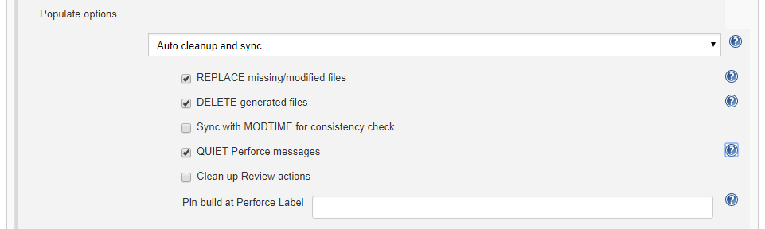

# Auto Cleanup and Sync
This is an efficient option that cleans and syncs file revisions in the workspace. Extra (non versioned files) are removed, missing and modified files re-added. This option is best for clean builds when the Perforce Helix Core Server controls the files in the workspace. 

## Options:
You can select a number of options: 
- **REPLACE missing/modified files:** Perforce checks out and overwrites any depot files that are either missing from the workspace, or have been modified locally.
- **DELETE generated files:** Perforce deletes any local files that are not in the depot.
- **Sync with MODTIME for consistency check:** Preserves the modification time of files during the sync operation. 
- **QUIET Perforce messages:** Enables the -q flag for all applicable Helix Server operations. Summary details will still be displayed.
- **Clean up Review actions:** Reverts open files in the pending changelist, but leaves the content in the workspace unchanged. Equivalent to `p4 revert -k`.
- **Pin build at Perforce Label:** When a build is triggered by **Polling**, **Build Now** or an external action, the workspace will only sync to the Perforce label in this field. Any other specified change or label will be ignored.
Supports variable expansion, for example `${VAR}`. If *now* is used, or a variable that expands to *now*, the latest change is used (within the scope of the workspace view). For more information about environment variables, see [Variable Expansion](VARIABLEEXPANSION.md).  

Click the browser **Back** button to go back to the previous page. 
