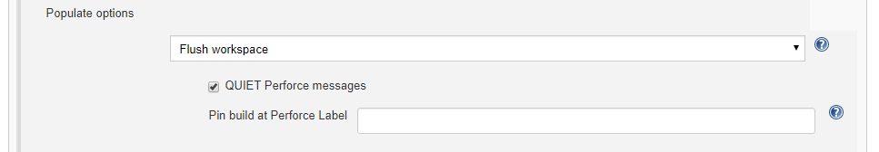

# Flush Workspace
This option is used when files in the workspace are not added by the Perforce Helix Core Server. No file Sync or cleanup is attempted and no files are removed, but the workspace "have list" is updated. This is effectively the same as using the `p4 sync -k` command.

## Options:
You can select a number of options:
- **QUIET Perforce messages:** Enables the -q flag for all applicable Perforce Helix Server operations. Summary details will still be displayed.
- **Pin build at Perforce Label:** When a build is triggered by **Polling**, **Build Now** or an external action, the workspace will only sync to the Perforce label in this field. Any other specified change or label will be ignored.
Supports variable expansion, for example `${VAR}`. If *now* is used, or a variable that expands to *now*, the latest change is used (within the scope of the workspace view). For more information about environment variables, see [Variable Expansion](VARIABLEEXPANSION.md).  

Click the browser **Back** button to go back to the previous page. 
