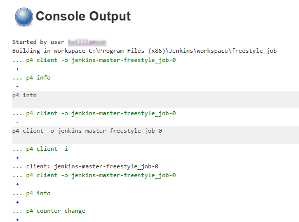

# Post Build Actions
When your build is complete you can view the change summary, and manually tag the build. 

## Change Summary
When your build is complete, you can view summary details of the build and the changes in the build. 
**View the build and changes summary:** 
1. From the Jenkins dashboard, click the job link name from the table. 
2. Click the build number in the **Build History** table in the sidebar. 
The build summary is displayed, this includes a summary of the changes:

3. To view the changes in more detail, click the **View Detail** link. 

## Console Output
When your build is complete, you can view a detailed log of the build from the console output. If you need to contact Perforce Support about build problems you will need to supply the console output for the build to help them to diagnose any issues.  
### View the console output:
1. From the Jenkins dashboard, click the job link name from the table. 
2. Click the build number in the **Build History** table in the sidebar. 
3. Click **Console Output** in the sidebar menu.
The console output is displayed:

4. If you need to send the console output to Perforce Support, send it as plain text. Click **View as plain text** in the sidebar menu.  

## Manually Tag Builds
Jenkins can tag builds automatically as a post build action or you can manually tag of a build. The Tags are stored in the Perforce Helix Core Server as automatic labels with the label view based on the workspace at the time of tagging.
For information about tagging a build with a with Post Build Action, see [Perforce: Label Build](POSTBUILDACTIONLABELBUILD.md).  
### Manually tag a build: 
1. From the Jenkins dashboard, click the job link name from the table. 
2. Click the build number in the **Build History** table in the sidebar. 
3. Click **Label This Build** in the sidebar menu. If the build has already been tagged the link will be **Perforce Label**.

4. Update the label name and description as required. Click **Label Build** to add the label to Perforce Helix Server. The label details are displayed for the build. New labels can be added to the same build or labels can be updated by using the same label name.

