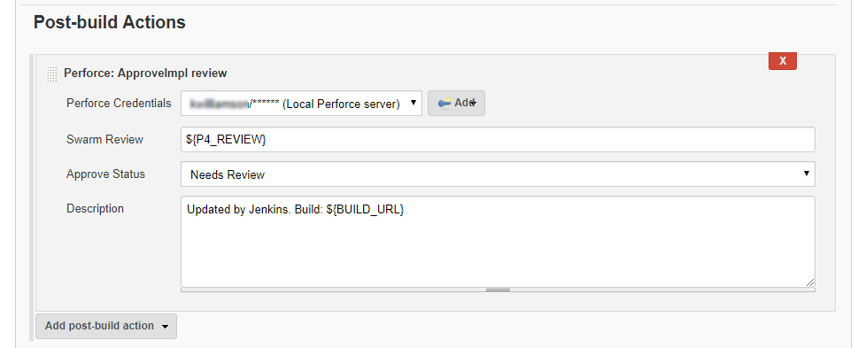

# Perforce: ApproveImpl Review
Helix Swarm required. Used to set the Swarm review state when the build completes. 

- **Perforce Credentials:** Select the credentials for Swarm from the **Perforce credentials** dropdown. 
- **Swarm Review:** When the build is complete the status of this Swarm review is set according to the value in the **Approve Status** field.  Enter the Swarm review ID  number or a custom environment variable `${VAR}`. For more information about environment variables, see [Variable Expansion](VARIABLEEXPANSION.md).   
- **Approve Status:** Select the status to set the Swarm review to when the build completes, options are: **Needs Review**, **Needs Revision**, **Approve**, **Approve and Commit**, **Reject**, **Archive**, **Vote Up**, or **Vote Down**. 
- **Description:** Enter the text to add to the Swarm review when its review status is changed. This is usually a mix of common text and one or more environment variables `${VAR}`.  For more information about environment variables, see [Variable Expansion](VARIABLEEXPANSION.md). 

Click the browser **Back** button to go back to the previous page. 
