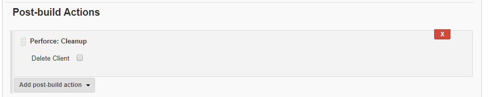


# Perforce: Cleanup
Used to cleanup the workspace after the build. 

- **Delete Client:** Select  to delete the client after the build.  

Click the browser **Back** button to go back to the previous page. 
