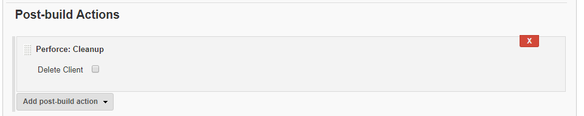

# Perforce: Cleanup
Used to cleanup the workspace after the build. 

- **Delete Client:** Select to delete the client after the build (`p4 client -d`).
- **Force Delete Client:** Select to force delete the client (`p4 client -f -d`).

## Pipeline usage
Symbol: `cleanup` (alias `p4cleanup`). Run it after a `p4sync`/`checkout`, inside `node`.

- `cleanup(true)` → `p4 client -d`
- `cleanup(deleteClient: true)` → `p4 client -d`
- `cleanup(deleteClient: true, forceDeleteClient: false)`→ `p4 client -d`
- `cleanup(deleteClient: true, forceDeleteClient: true)` → `p4 client -f -d`
- `cleanup(deleteClient: false, forceDeleteClient: true)` → `p4 client -f -d`
- `cleanup(deleteClient: false, forceDeleteClient: false)` → `client is not deleted
