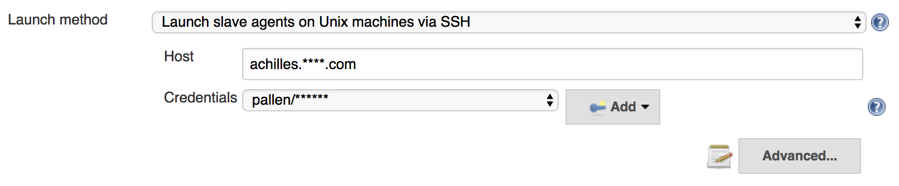
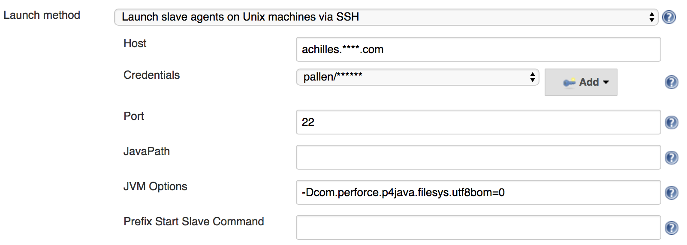

# UNICODE

This section covers specific issues and configuration settings for a Unicode enabled Perforce Server and the 
Jenkins build environment.

## Charsets

A Perforce Client Workspace must specify a Charset specific to the platform (Windows, Linux, etc...) when accessing
files from a Unicode enabled Perforce Server.  The Workspace configuration provides a CHARSET dropdown (with a default
of 'none' for non-unicode Perforce Servers).  For more information in Perforce Character sets please refer to our
[internationalisation notes](https://www.perforce.com/perforce/doc.current/user/i18nnotes.txt).

## UTF8 BOM

The UTF8 charset supports an optional BOM (Byte Order Mark) at the start of the file, represented by the byte 
sequence `0xEF 0xBB 0xBF`.  If a file has been added to Perforce with the type set to `utf8`, then the default 
behaviour is to sync the file with a BOM even if the file did not originally have the BOM sequence in the file.

There is an undocumented Perforce configurable `filesys.utf8bom` which can be modified to change the default
behaviour:

    filesys.utf8bom  (default 1)    Set to 0 to prevent writing utf8 files BOM
                                    Set to 1 to write utf8 files with a BOM
                                    Set to 2 to write utf8 BOM only on Windows
                                    
For Jenkins to make use of the configurable you need to set the JVM property on the Jenkins Master or Build Slave.
For example:

      -Dcom.perforce.p4java.filesys.utf8bom=0
      
For most use-cases you will need set the JVM option for the slave build node: 

 - Jenkins > Manage Jenkins > Manage Nodes > New Node or select Node and Configure
 
 - Select `Advanced`
 
  
  
 - Add the `-D` property to the `JVM Options`.
 
  
