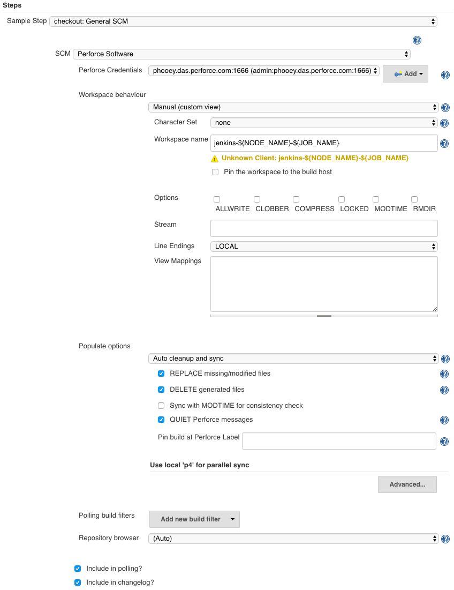
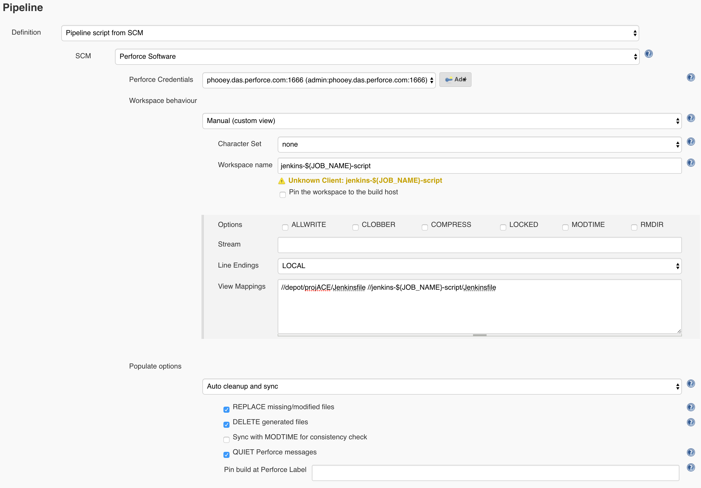
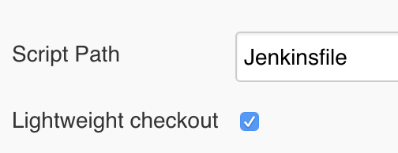
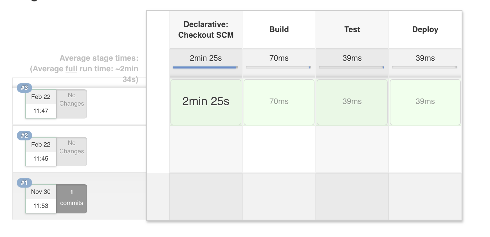

_Online documentation for [Pipeline Project](https://www.perforce.com/manuals/jenkins/Content/P4Jenkins/chapter-pipeline.html)_

# Workflow Setup Guide

This guide covers the setup and configuration of Perforce tasks from Jenkins Pipeline scripts and assumes the reader 
is experienced with Jenkins Pipeline.  If you are starting out or unfamiliar Pipeline please read The Jenkins Pipeline
documentation:
 
[https://jenkins.io/doc/book/pipeline/](https://jenkins.io/doc/book/pipeline/)


## Basic Populate

Almost all Perforce operations require a Perforce Credential, as in Freestyle Jobs the plugin for Pipeline requires
either a Perforce Password Credential or Perforce Ticket Credential.  For information about creating a Perforce credential, see 
[Credentials](CREDENTIALS.md).

When using a Perforce Credential with Pipeline it is recommended to set the ID field to a short user friendly name.
This might be hidden in the Advanced options depending on the version of your Jenkins server.

The simplest way to populate your Jenkins workspace from Perforce is by using the `p4sync` DSL.  This requires a 
minimum of three attributes: the Perforce Credential, a populate class and a codeline.  The 'Pipeline Syntax' snippet 
generator can help build the DSL code.  Select 'p4sync: P4 Sync' from the dropdown menu and fill out the attribute 
fields as required.

You only need to provide one codeline: 'Stream Codeline' for streams paths, 'Template Workspace' if you have defined
the path in another Workspaces View, or 'Depot path' to refer to a classic depot location in Perforce.


This generated the following snippet...

```groovy
p4sync(charset: 'none',
  credential: 'phooey1666', 
  populate: [$class: 'AutoCleanImpl', 
    delete: true, 
    modtime: false, 
    pin: '',
    quiet: true,
    replace: true],
  stream: '//streams/st1-main')
```

and you can paste it into a basic script. For example:

```groovy
node {
  stage('Sync') {
    // sync files from //streams/st1-main/...
    p4sync(charset: 'none',
      credential: 'phooey1666', 
      populate: [$class: 'AutoCleanImpl', 
        delete: true, 
        modtime: false, 
        pin: '',
        quiet: true,
        replace: true],
      stream: '//streams/st1-main')
  }
}
```

### Mulitple Syncs
If you need more than one sync task in a script you **MUST** use a different workspace name.

You can control this by customising the 'Workspace Name Format' field.  The default value is 
`jenkins-${NODE_NAME}-${JOB_NAME}-${EXECUTOR_NUMBER}` and will not appear in the generated snippet, however if you change this to
`jenkins-${NODE_NAME}-${JOB_NAME}-${EXECUTOR_NUMBER}-libs` you will see a new attribute in the snippet 
`format: 'jenkins-${NODE_NAME}-${JOB_NAME}-${EXECUTOR_NUMBER}-libs'`.

## Advanced Populate

If you require full access to the Populate options available with Freestyle Jobs you can use the General SCM checkout
option.  Select `checkout: General SCM` from the dropdown and choose `Perforce Software` from the SCM dropdown.



This allows full customisation of the Workspace View Mappings, for example:

```groovy
node {
  stage('Sync') {
    // sync files from //streams/st1-main/...
    checkout([$class: 'PerforceScm', 
      credential: 'phooey1666', 
      populate: [$class: 'AutoCleanImpl', 
        delete: true, 
        modtime: false, 
        parallel: [enable: false, minbytes: '1024', minfiles: '1', path: '/usr/local/bin/p4', threads: '4'], 
        pin: '', 
        quiet: true, 
        replace: true], 
      workspace: [$class: 'ManualWorkspaceImpl', 
        charset: 'none', 
        name: 'jenkins-${NODE_NAME}-${JOB_NAME}-${EXECUTOR_NUMBER}', 
        pinHost: false, 
        spec: [allwrite: false, 
          clobber: false, 
          compress: false, 
          line: 'LOCAL', 
          locked: false, 
          modtime: false, 
          rmdir: false, 
          streamName: '', 
          view: '''//depot/libs/${OS}/... //jenkins-${NODE_NAME}-${JOB_NAME}-${EXECUTOR_NUMBER}/libs/...
                   //depot/code/... //jenkins-${NODE_NAME}-${JOB_NAME}-${EXECUTOR_NUMBER}/code/...'''
        ]
      ]
    ])
  }
}
```

## Using standard Freestyle Jobs steps

You can use the Publish, Tag, Unshelve and Cleanup steps from Freestyle.  The are available from the dropdown menu
and use the same Configuration dialogs as Freestyle. 
For example: [P4 Publish](POSTBUILDPUBLISHASSETS.md)

```groovy
p4publish(credential: 'phooey1666', 
  publish: [$class: 'SubmitImpl', 
    delete: false, 
    description: 'Submitted by Jenkins. Build: ${BUILD_TAG}', 
    onlyOnSuccess: false, 
    purge: '', 
    reopen: false], 
  workspace: [$class: 'StreamWorkspaceImpl', 
    charset: 'none', 
    format: 'jenkins-${NODE_NAME}-${JOB_NAME}-${EXECUTOR_NUMBER}-publish', 
    pinHost: false, 
    streamName: '//streams/st2-rel1'])
```

## Using a versioned Jenkinsfile

Pipeline supports fetching the DSL script from the SCM.  Typically called `Jenkinsfile` and located in the root of
the project.  For the P4 Plugin to operate in this mode you need to provide a Perforce Credential and Workspace 
mapping the location of the Jenkinsfile.

To do this; create a Pipeline project and select 'Pipeline script from SCM', choose 'Perforce Software' for the SCM
and fill out the fields as required. For example:



### Important recommendations

 * Use a unique workspace name for the Jenkinsfile that will not get reused by the sync steps in the script.  A postfix
   of `-script` will help to identify the workspace's use and make it unique from code sync steps.

 * Only map the Jenkinsfile (and perhaps Pipeline libraries) in the workspace view.  Jenkins may create an '@script'
   directory on the master and you don't want to unnecessarily sync code to an area not used for the actual build.

## Lightweight checkout

The 'Pipeline script from SCM' would normally use a Perforce Sync to fetch the versioned Jenkinsfile, however if the 
workspace view included more than just the Jenkinsfile the operation could be expensive.  Jenkins introduced the 
'Lightweight checkout' option that can navigate the SCM and fetch files as required.  



Enabling the option will use a 'p4 print' to fetch the Jenkinsfile negating the need for syncing the script files.

### Important recommendations

If you are using declarative pipeline and not the old DSL, you will need to disable the automatic 'Declarative Checkout
SCM' step.  For example, the declarative pipeline script has three steps, yet the build will show four:

```groovy
pipeline {
    agent any

    stages {
        stage('Build') {
            steps {
                echo 'Building...'
            }
        }
        stage('Test') {
            steps {
                echo 'Testing...'
            }
        }
        stage('Deploy') {
            steps {
                echo 'Deploying...'
            }
        }
    }
}
```



Simply add `options { skipDefaultCheckout() }` to the agent.  For example:

```groovy
pipeline {
    agent any
    
    options { skipDefaultCheckout() }
    
    stages {
        stage('Build') {
            steps {
                echo 'Building...'
            }
        }
        stage('Test') {
            steps {
                echo 'Testing...'
            }
        }
        stage('Deploy') {
            steps {
                echo 'Deploying...'
            }
        }
    }
}
```

## Polling

Jenkins will poll for each sync step in a build script and also for the Jenkinsfile if using the 'Pipeline script from
SCM' option.  The advanced populate option `checkout: General SCM` provides check boxes to disable polling (and 
changelog).

### Advanced Polling

Polling requires access to previous build data (build.xml). The P4 Plugin tracks the previous build change using a
`syncID` as a polling operation might iterate over multiple sync steps.  The `syncID` is normally calculated from
the client workspace name, but must be unique enough to distinguish between multiple sync steps, but common enough
to identify previous builds.  For this reason if the client Workspace name contains any of the following variables
their values will be ignored when determining the `syncID`:

* NODE_NAME (which might change between slaves)
* BUILD_NUMBER (which changes for each build)
* EXECUTOR_NUMBER (changes based on the execution thread) 

In very rare circumstances a user may want to override the `syncID`, this can be done by specifying the attribute on
a `workspace:` class.

## Limitations

### Changelist reporting

Core Jenkins ties changelist reporting to individual 'p4 sync' commands. If the same job has multiple 'checkout' or
'p4sync' steps that sync the same changelist it will be reported once for each individual sync on the 'Status'
and 'Changes' pages. The P4Jenkins plugin is not able to override this behavior.


