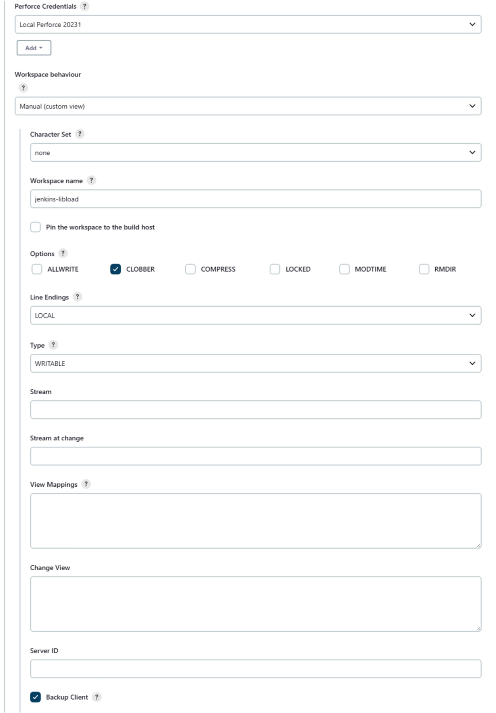

# Manual Workspace
Manually define the workspace view and sync options. Creates the workspace if it does not already exist or updates the workspace spec by setting the various options if it already exists. Jenkins will fill out the workspace root and may override the `CLOBBER` option.  


1. **Workspace behaviour:** select **Manual (Custom View)** from the dropdown list. 
2. **Character Set:** sets the character set used by Jenkins when syncing files from the Perforce Helix Core Server. This should be set to **none** unless the workspace is connected to a Unicode enabled Helix Server. 
3.  **Workspace name:** Jenkins slave nodes must each use a unique Perforce workspace. The format string configures the workspace name by substituting the specified variables. At least one variable must be used, but it is recommended that, as a minimum, the following variables are used:
```
jenkins-${NODE_NAME}-${JOB_NAME}-${EXECUTOR_NUMBER}
```
For more information about variables, see [Variable Expansion](VARIABLEEXPANSION.md):  
4. **Pin the workspace to the build host:** usually left unselected because the `${NODE_NAME}` variable in the **Workspace name** field does this for you.  
5. **Options** there are a number of options that can be set to configure client behaviour: 
- **ALL WRITE:** select to leave all files writable on the client. By default, only files opened by `p4 edit` are writable. If set, files might be clobbered as a result of ignoring the `CLOBBER` option (see below).
- **CLOBBER:** select to permit `p4 sync` to overwrite writable files on the client. `noclobber` is ignored if `allwrite` is set.
- **COMPRESS:** select to compress data sent between the client and Helix Server. This is used to speed up slow connections. 
- **LOCKED:** select to allow only the client owner to use or change the client spec. Prevents the client spec from being deleted or unloaded. 
- **MODTIME:** select to make `p4 sync` and `p4 submit` preserve file modification times, as with files with the `+m` type modifier. For more information about MODTIME, see `p4 help filetypes`. With `nomodtime`, file timestamps are updated by sync and submit operations.  

6. **Line Endings:** there are a number of options to set line-ending characters for client text files:
- **Local:** line endings are automatically set to match the build machine operating system style. 
- **UNIX:** linefeed, UNIX style.
- **MAC:** carriage return, Macintosh style. (obsolete). 
- **WIN:** carriage return-linefeed, Windows style.
- **SHARE:** hybrid, writes UNIX style but reads UNIX, Mac, or Windows style.
7. **Type:** there are a number of options for setting the client type:
- **WRITABLE:** by default all clients are writable. Certain clients are short lived and perform long sync and build cycles. Over time these build clients can fragment the Perforce **db.have** database table that is used to track which files a client has synced. 
- **GRAPH:** Helix Server 2017.2 and later required. When working with Helix4Git, select to enable Jenkins to use P4 commands with Graph depot. 
- **READONLY:** select readonly to give the client its own personal db.have database table. A readonly client cannot edit or submit files. For build automation this is not usually a requirement and the performance tradeoff is worth considering if your build automation is causing issues with the db.have table. The client.readonly.dir setting must be configured by an administrator before using this option.  
- **PARTITIONED:** select if changes are submitted as part of your build. You can specify a partitioned client like a readonly client. This type also has a separate db.have table under the client.readonly.dir directory, but allows journaled edit and submit of files. 
8. **Stream:** if using streams, specify the full Perforce depot path for the stream that will be used to create or update the Jenkins build workspace. If you are connected to a Helix Server, streams will be auto suggested as you type. 
9. **View Mappings:** displays the mapping of the depot files to your client workspace. This defines the files that you want in your client workspace and specifies where you want them to reside. The default view maps all depot files onto the client. For information about the view syntax, see [Client Views](https://www.perforce.com/perforce/doc.current/manuals/cmdref/index.html#CmdRef/views.html) in the [P4 Command Reference Guide](https://www.perforce.com/perforce/doc.current/manuals/cmdref/index.html#CmdRef/about.html). A new view takes effect on the next `p4 sync`. 
10. **Server ID:** if set, restricts usage to the named server. If unset, usage is allowed on the master Helix Server and on any replicas of the master other than Edge Servers. 
11. Click the browser **Back** button to go back to the previous page. 
