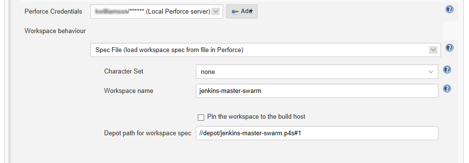

# Spec File Workspace
Loads the workspace configuration from a depot file containing a client workspace spec. This is the same output as `p4 client -o` and the Spec depot `.p4s` format. The name of the Workspace (to be used by Jenkins) must match the name of the client in the workspace spec. The simplest method is to use the ${P4_CLIENT} variable in the spec, for example:

    FILE: //depot/jenkins-master-swarm.p4s
    --------------------------------------------------------------------------
    Client:	        ${P4_CLIENT}
    Owner:	        pallen
    Description:
          Created by pallen.
    Root:	        /Users/pallen/Perforce/1666/ws
    Options:	noallwrite noclobber nocompress unlocked nomodtime normdir
    SubmitOptions:	submitunchanged
    LineEnd:	local
    View:
	      //depot/projA/... //${P4_CLIENT}/...	

In the configuration specify the workspace name to be used by Jenkins and the location of the spec file.

1. **Workspace behaviour:** select **Static (static view, master only)** from the dropdown list. 
2. **Character Set:** sets the character set used by Jenkins when syncing files from the Perforce Helix Core Server. This should be set to **none** unless the workspace is connected to a Unicode enabled Helix Server. 
3. **Workspace name:** specify the name of the existing Perforce workspace that will be used as the Jenkins build workspace. If you are connected to a Helix Server, workspaces will be auto suggested as you type. Updates are only applied when the workspace is used. If the workspace does not exist yet, the configuration will be saved in Jenkins. The workspace is only created when it is used.  
4. **Depot path for workspace spec:** specify the depot path  the existing Perforce workspace spec is stored in. If you are connected to a Helix Server, suitable paths will be auto suggested as you type. 

Click the browser **Back** button to go back to the previous page. 
