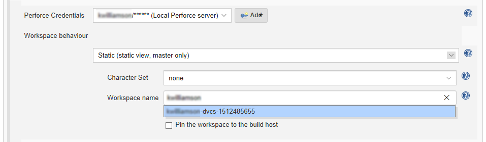

# Static Workspace
Uses a predefined workspace, the workspace must have a valid view and must already exist. The plugin user must either own the workspace or the spec must be unlocked allowing the plugin user to make edits. The workspace view remains static, but Jenkins will update other fields such as the workspace root and `CLOBBER` option.

1. **Workspace behaviour:** select **Spec File (load workspace spec from file in Perforce)** from the dropdown list. 
2. **Character Set:** sets the character set used by Jenkins when syncing files from the Perforce Helix Core Server. This should be set to **none** unless the workspace is connected to a Unicode enabled Helix Server. 
3. **Workspace name:** specify the name of the existing Perforce workspace that will be used as the Jenkins build workspace. If you are connected to a Helix Server workspaces will be auto suggested as you type. 

Click the browser **Back** button to go back to the previous page. 
