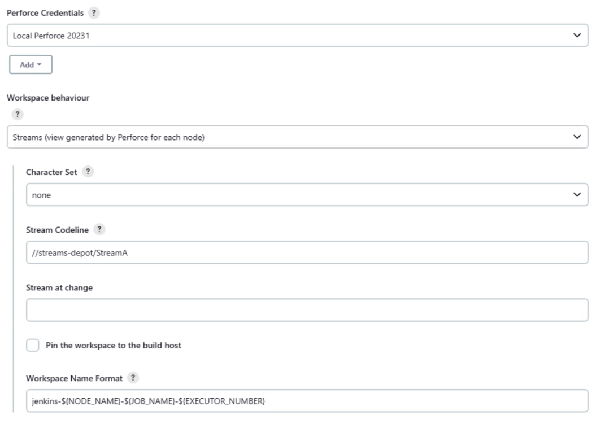

# Streams Workspace
Uses a specified template to generate the workspace view. The name of the workspace is generated using the **Workspace Name Format** field. This makes it an ideal choice for Matrix builds. 


 1. **Workspace behaviour:** select **Streams (view generated by Perforce for each node)** from the dropdown list. 
 2. **Character Set:** sets the character set used by Jenkins when syncing files from the Perforce Helix Core Server. This should be set to **none** unless the workspace is connected to a Unicode enabled Helix Server. 
 3. **Stream Codeline:** specify the full Perforce depot path for the stream that will be used to create or update the Jenkins build workspace. If you are connected to a Helix Server, streams will be auto suggested as you type. 
 4. **Pin the workspace to the build host:** this can usually be left unselected because the `${NODE_NAME}` variable in the **Workspace Name Format** field does this for you.  
 5. **Workspace Name Format:** Jenkins slave nodes must each use a unique Perforce workspace. The format string configures the workspace name by substituting the specified variables. At least one variable must be used, but it is recommended that, as a minimum, the following variables are used: 
```
jenkins-${NODE_NAME}-${JOB_NAME}-${EXECUTOR_NUMBER}
```
For more information about variables, see [Variable Expansion](VARIABLEEXPANSION.md).  

6. Click the browser **Back** button to go back to the previous page. 

